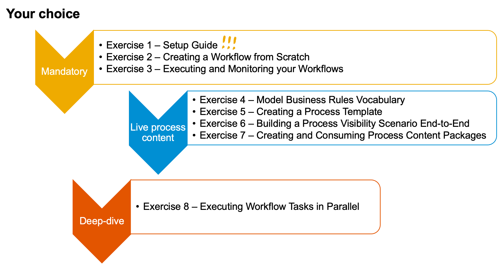

# DEV164 - Develop, Configure, and Provision Application Workflows and Content

## Description

This repository contains the material for the SAP TechEd 2021 session called [*DEV164 - Develop, Configure, and Provision Application Workflows and Content*](https://reg.sapevents.sap.com/flow/sap/sapteched2021/portal/page/sessions/session/16303673693580013Vw7).  

## Overview

This session introduces attendees to create workflows and prepare process templates for fast and easy reuse without coding. Leverage business rules and process visibility in your workflows. Finally create content packages for common business scenarios for your organization, desired by your business units and your citizen developers.

[Presentation slides](https://github.com/SAP-samples/teched2021-DEV164/blob/main/DEV164.pdf)

## Requirements

The requirements to follow the exercises in this repository are a trial account (in data center US10 or AP21) in SAP Business Technology Platform and subscription to SAP Workflow Management, as described here in the [Setup Guide](https://github.com/SAP-samples/teched2021-DEV164/tree/main/exercises/1_SetupTrial).

## Exercises

Mandatory for everyone:
- [Exercise 1 - Setup Guide](https://github.com/SAP-samples/teched2021-DEV164/tree/main/exercises/1_SetupTrial) [**IMPORTANT**]
- [Exercise 2 - Creating a Workflow from Scratch](https://github.com/SAP-samples/teched2021-DEV164/tree/main/exercises/2_WorkflowFromScratch)
- [Exercise 3 - Executing and monitoring your Workflows](https://github.com/SAP-samples/teched2021-DEV164/tree/main/exercises/3_RunMonitorWorkflows)   

Either move on here (**Live Process Content - how to create and consume**)
- [Exercise 4 - Model Business Rules Vocabulary](https://github.com/SAP-samples/teched2021-DEV164/tree/main/exercises/4_ModelVocabulary)
- [Exercise 5 - Creating a Process Template](https://github.com/SAP-samples/teched2021-DEV164/tree/main/exercises/5_CreatingProcessTemplate)
- [Exercise 6 - Building a Process Visibility Scenario End-to-End](https://github.com/SAP-samples/teched2021-DEV164/tree/main/exercises/6_BuildingVisibilityScenario)
- [Exercise 7 - Creating and Consuming Process Content Packages](https://github.com/SAP-samples/teched2021-DEV164/tree/main/exercises/7_CreatingContentPackages) 
  
Or here (**Parallel execution of tasks**)
- [Exercise 8 - Executing Workflow Tasks in Parallel](https://github.com/SAP-samples/teched2021-DEV164/tree/main/exercises/8_ExecuteWorkflowApprovalsInParallel)   

## How to obtain support

Support for the content in this repository is available during the actual time of the online session for which this content has been designed. Otherwise, you may request support via the [Issues](../../issues) tab.

## Further Learning
Please find some further sources to get educated on SAP Workflow Management:
- [Join the SAP Community around SAP Workflow Management](https://community.sap.com/topics/workflow-management)
- [Join the openSAP course "Improve business processes with SAP Workflow Management](https://open.sap.com/courses/btp2)
- [Run the missions in SAP Discovery Center](https://discovery-center.cloud.sap/missionssearch/?showFilters=true&appType=platform&category=extensionsuite-digitalprocessautomation)
- [Register for course from SAP Education: CLD500 - Introduction to SAP Workflow Management powered by SAP BTP](https://training.sap.com/course/cld500-introduction-to-sap-workflow-management-powered-by-sap-btp-classroom-013-g-en/?)   

## License
Copyright (c) 2021 SAP SE or an SAP affiliate company. All rights reserved. This project is licensed under the Apache Software License, version 2.0 except as noted otherwise in the [LICENSE](LICENSES/Apache-2.0.txt) file.
