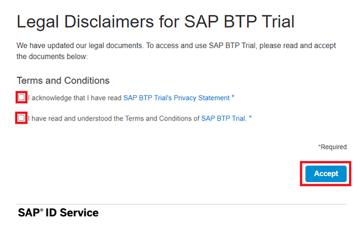

# Setup Guide

If you have already followed successfully the setup guide sent to you upfront, you can move to the chapter **[2.1 Create Role Collection for Workflow Management](#createrolecollection)**.
If not, please follow all the steps below to setup SAP Workflow Management.

## Table of contents

<!-- TOC -->

- [1 - Onboard to SAP Business Technology Platform Trial](#onboard-to-sap-business-technology-platform-trial)
- [2 - Setup SAP Workflow Management](#setup-wfm)
- [3 - Import Sample Content](#section1-import)
- [Conclusion](#conclusion)

<!-- /TOC -->


# Trial onboarding with SAP Workflow Management

In this section you will learn how to register to a trial tenant in SAP Business Technology Platform with SAP Workflow Management booster.

# 1 - Onboard to SAP Business Technology Platform Trial<a name="onboard-to-sap-business-technology-platform-trial"></a>

1. Click on the button **Try for free** on the Free Trials page of SAP Business Technology Platform: [https://www.sap.com/products/business-technology-platform/free-trials.html](https://www.sap.com/products/business-technology-platform/free-trials.html)

    

2. In the page, select the **Individual users** tab and click on the **Sign-up for a free trial** to enter requested information.

    

3. Fill the form and click on **Submit** and wait the Welcome message.

    

4. Click to start your trial experience!

    

5. Verify your account if needed

    

6. You need to **accept** the legal disclaimers for SAP Cloud Platform trial to **Enter your Trial Account**.

    

7. Choose the data center **US East (VA) - AWS** and click **Create Account** to trigger the trial account creation.

    

8. Once done click **Continue**

    

# 2 - Setup SAP Workflow Management <a name="setup-wfm"></a>

1. Click **Boosters**

    

2. Search for **workflow** and click **Start** on Set up account for Workflow Management

    

3. Wait until the different steps are done 

    

4. Click **Navigate to Subaccount**.

    
## 2.1 Create Role Collection for Workflow Management <a name="createrolecollection"></a>
1. Once in your trial account, click on the tile **trial** to enter the Trial subaccount.

    

2. Open **Security** and select **Role Collections**. Click on **(+)** to create a new Role Collection with a name.

    

3. Assign the name **LocalManager** and click **Create.**

    

4. Click on the newly created role collection to edit it.

    

5. Click **Edit.**

    

6. Assign your SAP BTP trial user to this role collection

    

7. Click **Save.**

    

8. Repeat these steps for the role collection **GroupHead** and  **CFO**.

    
## 2.2 Configure Destinations
1. Click **Services -> Instances and Subscriptions** and select the following.
    - Select Business Rules from the dropdown.
    - Select wm_businessrules service instance to view the credentials.
    - Click view credentials.
   
1. Copy the endpoints element from the JSON structure (between line 3 and 6). Copy the structure between the curly braces, and also the curly braces itself. This will be used in the next step.
   
1. Click  **Connectivity -> Destinations**  from the left-hand navigation and search for the destination with name **BUSINESS_RULES**. Click **Clone** Button.

    
1. Updates the Cloned Destiation.
- Update **Name** as **WM_BUSINESSRRULES**
- Click **New Property** and update property name as **endpoints**. 
- Update the property value from the previous step. If you are using EU10 Data center the below JSON element can be used. If you are using US10 or AP21, replace **eu10** with us10 or ap21.
```json
    {
        "rule_repository_url": "https://bpmrulerepository.rule.cfapps.eu10.hana.ondemand.com",
        "rule_runtime_url": "https://bpmruleruntime.rule.cfapps.eu10.hana.ondemand.com"
    }
```
   -  Click Save Button
   

5. Click  **Connectivity -> Destinations**  from the left-hand navigation and search for the destination with name **WM\_CF\_SPACE\_PROVIDER.** Click on the destination to configure its properties

    

6. In **Destination Configuration** section, click **Edit**, then **Enter your trial user password** and click **Save**.

    > Caution: Ensure that the **Two Factor Authentication** is [disabled for the user](https://help.sap.com/viewer/6d6d63354d1242d185ab4830fc04feb1/Cloud/en-US/d26427a2c503456bbdfec53d385e0433.html) whose username and password are entered in the destination configuration. If not, then register a new user with 2FA disabled.

    **WM\_CF\_SPACE\_PROVIDER** destination is used in Process Flexibility Cockpit while importing the sample content from API Business Hub. This destination is already created in the previous steps, and now you have configured the credentials for the destination.

    > ### Important Note: You need to change your password in any case since the one that seems to be there is not valid.

    
    
7. You might want to select **Check Connection**. You should receive a green checkmark. The message *Response returned: "404: Not Found* you can ignore.


# 3 - Import Sample Content <a name="section1-import"></a>

1. In your sub-account, do the following:
      - Click **Instances and Subscriptions**, from the left-panel.
      - In *Subscriptions* section, click on application link for SAP Workflow Management.
      
      <p>
      

3. From the Workflow Management Launchpad, click **Process Flexibility Cockpit** tile.

      
 
4. Click **Discover Packages**

      

5. Search for *sample* and click on **Sample Capital Expenditure Approval Process** to navigate into the content package.

      

6. Read the content overview to get information of the content and click on **Import**. 

      
      
   
    > In the **Import Package** popup that comes, click on **Import** to continue. 
       > 
      
    > Wait for the content to import. It will take 2-3 minutes for the content to be imported.
       > 
    

9. Click on **My Live Processes** link on top left to go back the to Live Processes dashboard.
    > Once the content is import successfully, you will see the *Import* button changes to *Configure*.

      

10. Click on the **Sample Capital Expenditure Approval Process** to navigate into the package to activate the business rules.

      

11. As you go into the package, click on **Determine All Approvers** rule from **Decisions** tile. 

      

12. In the **Manage Decisions** application, click on **Activate**. 
    
    >This will activate and deploy the business rules in your trial account. 
    
    

  
## Conclusion <a name="conclusion"></a>

Congratulations! You have now successfully subscribed to the Business Technology Platform Trial and imported the sample content. You can use it to discover all functionalities provided by SAP Workflow Management.
    
Now move on with [Exercise 2 - Creating a Workflow from Scratch](https://github.com/SAP-samples/teched2021-DEV164/tree/main/exercises/2_WorkflowFromScratch).

# Troubleshooting <a name="section1-troubleshooting"></a>

##### Symptom: Import of the sample package fails with this error as the user has 2FA enabled


1. Download [SampleCapitalExpenditureApprovalRules.zip](https://github.com/SAP-samples/teched2021-DEV164/blob/main/exercises/Solution/SampleCapitalExpenditureApprovalRules.zip) rules project.

1. From the *Workflow Management Launchpad*, click **Manage Rule Projects** tile.

    

1. Click **Import** and then click **Upload Project from File System**.

    

1. Click **Browse** to select the downloaded zip file.
    - Click **Import**. 
    
    

> The business rules project will be imported as REVISED CONTENT.

1. Click on the **SampleCapitalExpenditureApprovalRules** to navigate into the project to deploy the business rules.

    

1. Switch to **Rule Services** tab.
    - Click **Deploy** to deploy *Determine All Approvers* rule service. 
    
    

1.	Select **Cloud Runtime** as system to deploy.

    


  > Wait for the successful deployment message to appear on the screen. 

