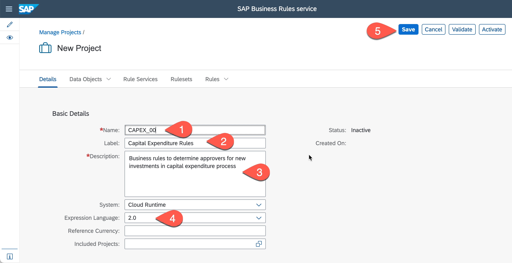
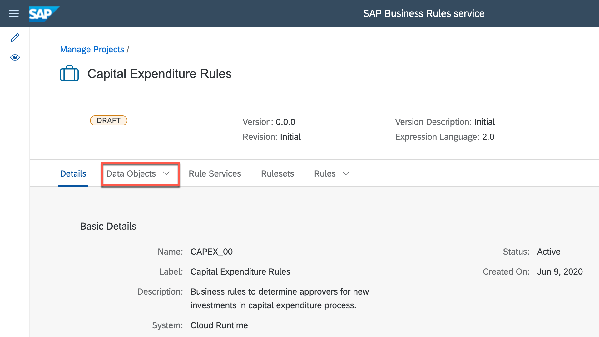
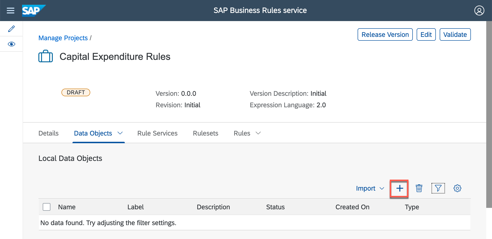
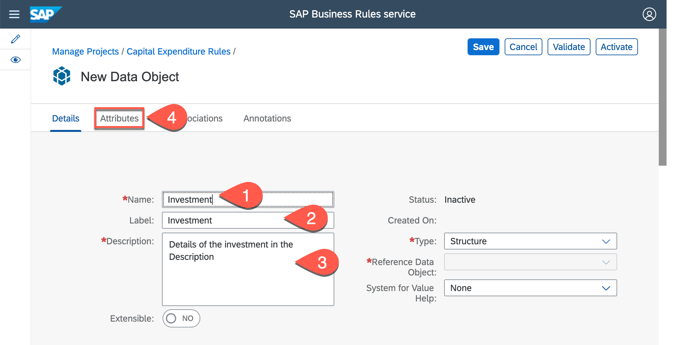
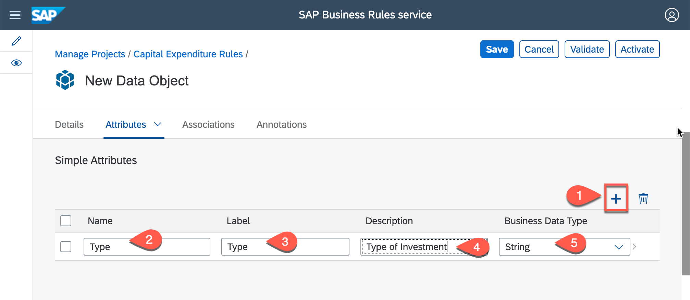
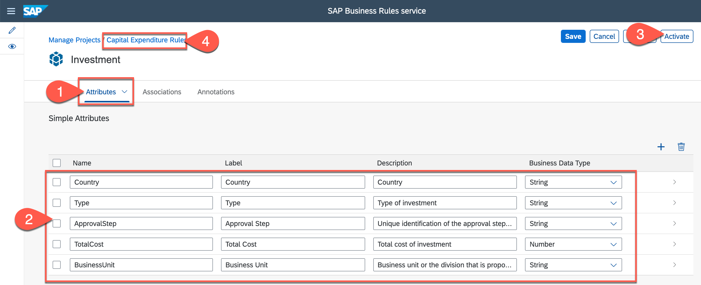

# Model Businenss Rules Vocabulary 

## Table of Contents

## Table of Contents
- [Author, Activate and Deploy Business Rules](#section1)
    - [Overview](#section1-overview)
    - [Create Project](#section1-createproject)
    - [Create Data Object](#section1-dataobject)
    - [Summary](#summary)
   

## Author and  Activate  Data Objects 
### Overview 

The exercise is based on authoring Data Object, using SAP Business Rules service. The Data Object is used in the next exercise to associate to a Process Template to generate start and step conditions.  
  
### Create Project 

1. Open *Workflow Management Launchpad* and click to open **Manage Rule Projects**.
    - Login with trial username and passwords 

    
    
  
2. Click **+** to create a new business rules project.

    

3. In the *New Project* screen, do the following:
    - Enter **CAPEX_00** in the **Name** box.
    - Enter **Capital Expenditure Rules** in the **Label** box.
    - Enter **Business rules to determine approvers for new investments in capital expenditure process** in **Description** box.
    - Select **2.0** as the **Expression Language**.
    - Click **Save** 
    

     

#### Your business rules project is created with the needed configurations. 

### Create Data Objects 

1.	Click **Data Objects** tab
    

     
  
2.	Click **+** in *Local Data Objects* section to create data object
    

     

3. In the *New Data Object* screen, do the following:
    - Enter **Investment** in the **Name** box.
    - Enter **Investment** in the **Label** box.
    - Enter **Details of the investment** in the **Description** box.
    - Click **Attributes** tab.
    
    

     
    
4. In *Simple Attributes* section of *Attributes* tab, do the following:
    - Click **+** to create attribute.
    - Enter **Type** in the **Name** box.
    - Enter **Type** in the **Label** box.
    - Enter **Type of investment** in the **Description** box.
    
    

     
    
 5. Repeat the step 4 above to create more data object attributes with following details: 
    
    | Name | Label | Description | Type |
    |---|---|---| --- |
    | Country | Country | Country | String |  
    | TotalCost | Total Cost | Total cost of investment  | Number | 
    | BusinessUnit | Business Unit | Business unit or the division that is proposing the investment  | String | 
    
    

     
    
    - Click **Activate**
    - Click **Capital Expenditure Rules** to navigate back to the *Data Objects* page
