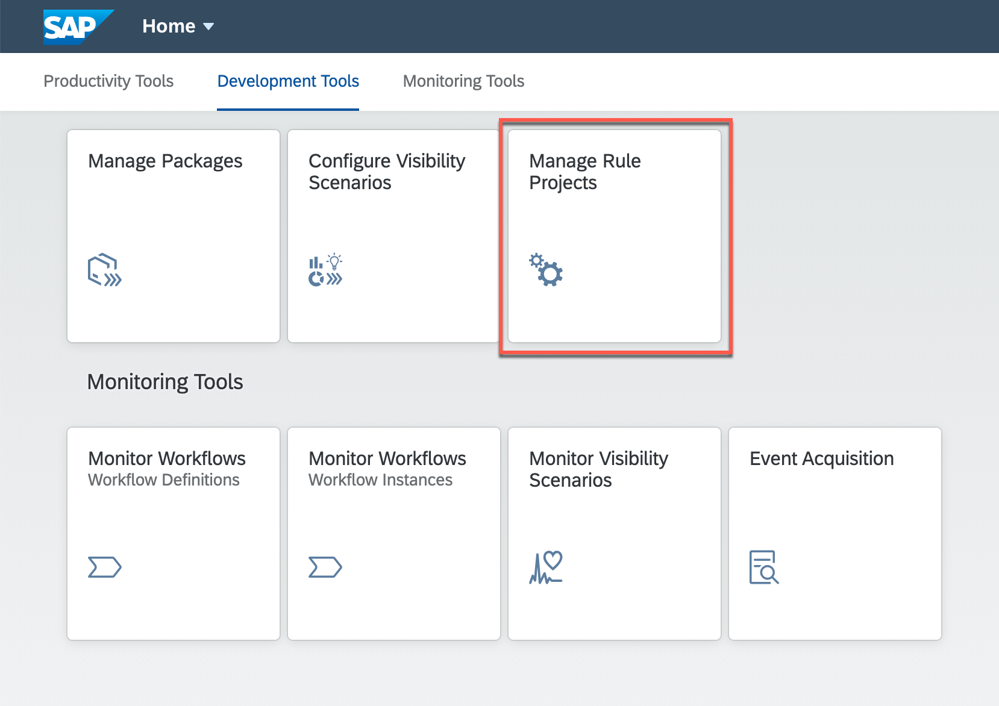
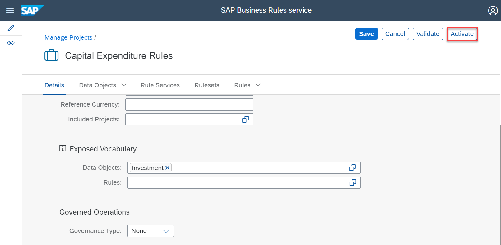

# Model Business Rules Vocabulary 

## Table of Contents
- [Overview](#section1-overview)
- [1 - Create Project](#section1-createproject)
- [2 - Create Data Object](#section1-dataobject)
- [3 - Expose Data Object](#section1-ExposeDataObject)
- [Conclusion](#Summary)

## Author and Activate Data Objects 
### Overview 

The exercise is based on authoring Data Object, using SAP Business Rules service. The Data Object is used in the next exercise to associate to a Process Template to generate start and step conditions.  
  
### 1 - Create Project 
1. Open *Workflow Management Launchpad* and click to open **Manage Rule Projects**.

1. Click **+** to create a new business rules project.

1. In the *New Project* screen, do the following:
 - Enter **CAPEX_00** in the **Name** box.
 - Enter **Capital Expenditure Rules** in the **Label** box.
 - Enter **Business rules to determine approvers for new investments in capital expenditure process** in **Description** box.
 - Select **2.0** as the **Expression Language**.
 - Click **Save** 

Your business rules project is created with the needed configurations. 

### 2 - Create Data Objects 
1. Click **Data Objects** tab

1. Click **+** in *Local Data Objects* section to create data object

1. In the *New Data Object* screen, do the following:
    - Enter **Investment** in the **Name** box.
    - Enter **Investment** in the **Label** box.
    - Enter **Details of the investment** in the **Description** box.
    - Click **Attributes** tab.  
     
1. In *Simple Attributes* section of *Attributes* tab, do the following:
    - Click **+** to create attribute.
    - Enter **Type** in the **Name** box.
    - Enter **Type** in the **Label** box.
    - Enter **Type of investment** in the **Description** box.
      
1. Repeat the step 4 above to create more data object attributes with following details: 
    | Name | Label | Description | Type |
    |---|---|---| --- |
    | Country | Country | Country | String |  
    | TotalCost | Total Cost | Total cost of investment  | Number | 
    | BusinessUnit | Business Unit | Business unit or the division that is proposing the investment  | String | 
   
    
1. Click **Activate**. 
1. Click **Capital Expenditure Rules** to navigate back to the *Data Objects* page. 
    
### 3 - Expose Data Object
1. In Project Details do the following to expose the Data Object to be consumed by the Process Template later. Select **Project Details** and scroll down to *Exposed Vocabulary*. Click **Data Object** to select the modeled data object.   

1. In the **Data Objects** dialogue select **Investment data object** and click **OK** button.   

3. Click **Activate** to activate the project.   

1. Click **Release Version** to releaes the project.   

1. Update the followng to release the Project.
    - **Version** as 1.0.0
    - **Revision** as Trial
    - **Description** "Vocabulary to create Step and Start Condition"
    - Click **Release** button

1. Copy the **Project ID** to be used by the Process Template editor
- Go to **Manage Projects**.
- Click Project Settings.    

- Select the **ID** field from the list and click **OK** button.  

1. Copy the Project ID field and keep it in your notepad.

### Conclusion
Now you have modeled a Business Rules Project with a Data Object and exposed it for consuming from Process Template Editor in the next excercise.
