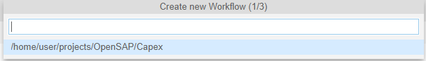

# Executing Workflow Tasks In Parallel
## Table of Contents

   -  [Overview](#overview)
   - [Model Workflow](#workflow)
   - [Execute Workflow](#excute)
   - [Summary](#summary)
   
## Overview<a name="overview"></a>
While modeling a workflow, it is a common requirement to execute approval steps in parallel. This could be static or dynamic number of approal steps. Static number of approvals can be modeled using Workflow editor and Process Variant Editor. SAP Workflow Management now supports parallel execution of approval steps and developers can determine the number of parallel approvals during runtime and execute them in parallel. This exercise guides you how to model and execute parallel approval steps.
## Model Workflow<a name="workflow"></a>
1. Open your Business Application Studio and select your modeled MTA project.
1. Click **View** and select **Find Command**.  

1. Type **Workflow** and choose **Create New Workflow**.   

1. Select Workflow Module Name **CAPEX**.       

*You can ignore the optional property name space*.    
1. Enter the workflow name, for example: "CapitalExpenditureParallelApproval".   
 
*The new workflow is now available with a start and end event.*   
1. Update the **Subject** and **Business Key** with appropriate parameterized strings.   

1. Select the **Start Event** and use the speed buttons to select **Referenced Subflow**.   

1. Select *Start Event* and in the Properties choose **Details**.   
1. Check **Configure Sample Context**.   
1. Click link **Create File**.    

1. In the dialgoue enter Name, for example **CapexParallelApprovalStartPayload**.    

1. Remove the default JSON content.   
1. Open the provided file [CapexParallelApprovalStartPayload.json.json](files/CapexParallelApprovalStartPayload.json.json) and copy the content into the open editor window. Replace **Name** and **UserId** with your name and BTP user Id.
```json
{
    "RequestId": "CAPEX_REQ_001",
    "Title": "Build mobile apps",
    "Requester": {
        "Name":"<your name>",
        "UserId":"<your userId>",
        "Comment":"Please Approve"
    },
    "Investment": {
        "Type": "Software",
        "Description": "Provide a fresh experience for our customers by providing new apps for our services",
        "TotalCost": 15000,
        "CAPEX": 10000,
        "OPEX": 5000,
        "ROI": 5,
        "Currency": "EUR",
        "BusinessUnit": "Purchasing",
        "Country": "Germany"
    },
    "ApprovalSteps":
     [
         {"ApprovalStep":"LocalManager"},
         {"ApprovalStep":"GroupHead"},
         {"ApprovalStep":"CFO"}
     ],
     "ApprovalHistory":
     [
          {},{},{}
     ]
   
}
```
1. Select the Referenced Subflow artifact and from Properties choose **DETAILS**.
1. Click **Select** to choose a Workflow Definition as Referened Subflow.   

1. Expand the Workflow node and Select **ApprovalStep.workflow**.   
1. Click OK Button.

1. Check **Propagate Principal** to enable principal propagation while creating the referenced workflow during runtime.
1. Click **Select** and from the dialogue window choose **StartEvent1**.   

1. Change **Type** to **Parallel**.  
1. Update **Collection Context Path** with '${context.ApprovalSteps}'.     

1. Select tab **MAPPING**.   

1. Within **Input Mapping** click **Add** button five times.
1. Update the Source Context Path and Target Context Path as given below.
*Source Context Path is the Main workflow context and Target Context Path is the Referenced Subflow context path.**loop.counter** is a standard variable to access the index of the collection attached to the reference subflow*.
Source Context Path | Target Context Path
   --- | ---
   `${context.RequestId}` |`${context.RequestId}`
   `${context.Title}` |`${context.Title}`
   `${context.Requester}` |`${context.Requester}}`
   `${context.Investment}` |`${context.Investment}`
   `${context.ApprovalSteps[loop.counter].ApprovalStep}` |`${context.approvalstep}`
1. Within **Output Mapping** click **Add** button.
Source Context Path | Target Context Path
   --- | ---
   `${context.History}` |`${context.ApprovalHistory[loop.counter]}`
1. Build your MTA Project.   
 
1. Deploy your MTA Archive.    


## Execute Workflow<a name="execute"></a>
1.Click **Monitor Workflows - Workflow Definitions** tile to view the newly deployed workflow definition.   

1. Select the newly deployed Workflow Definition.   
1. Click **Start New Instance** action in the footer.   

1. Click **Start New Instance and Close**.   

1. Click **Show Instances** button to see the newly created Workflow Instance.   

1. Select **EXECUTION LOG** and you can see three Referenced Subflows are started. Each Subflow is of type Approval Step and has a Workflow Task to approve.   

1. Navigate to Home Page and Select **My Inbox**.    
1. Click **My Inbox** tile.
*You can see there are three tasks in your My Inbox for approvals.*   

*You can see there are three tasks in parallel.*
- Local Manager Approval
- Group Head Approval
- CFO Approval

1. Click **Approve** to complete all three tasks.
1. Navigate to Home and Select **Monitor Workflow Workflow Instances** tile.
1. Add Status Filter **"Completed"**.
*You can see the newly workflow instance completed and the Workflow Context Shows the History of approvals. The Execution log shows the status of three Referenced Subflow instances.*   


 ## Summary<a name="summary"></a>
 Now you have learned how to configure Referenced Subflow and enable parallel approvals dynamically.

